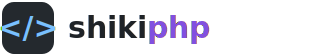

<p align="center">
  <picture>
    <source media="(prefers-color-scheme: dark)" srcset="./docs/public/logo-dark.svg">
    <source media="(prefers-color-scheme: light)" srcset="./docs/public/logo-light.svg">
    
  </picture>
</p>

<p align="center">
  Pure PHP syntax highlighter — a port of Shiki. Style code blocks with VS Code themes and TextMate grammars, in PHP only.
</p>

<p align="center">
  <a href="https://github.com/inline0/shikiphp/actions/workflows/ci.yml"></a>
  <a href="https://packagist.org/packages/shikiphp/shikiphp"></a>
  <a href="https://github.com/inline0/shikiphp/blob/main/LICENSE"></a>
</p>

---

## What is shikiphp?

shikiphp is a pure PHP port of [Shiki](https://shiki.style), the syntax
highlighter that powers VS Code's own coloring. It tokenizes code with the same
**TextMate grammars** and paints it with the same **VS Code themes** Shiki uses,
producing identical HTML — entirely in PHP.

**The problem:** server-rendered syntax highlighting in PHP usually means either
shelling out to Node, calling a hosted API, or settling for a regex-based
highlighter that doesn't understand the language. None of those are great for a
Laravel/WordPress/static-site build step.

**shikiphp solves this** by porting Shiki's real pipeline to PHP:

- TextMate grammar tokenizer (a faithful port of `vscode-textmate`), incl.
  embedded languages, injections, and nested repositories
- VS Code theme resolution with scope-selector specificity (`vscode-textmate`'s theme matching)
- A pure-PHP **JavaScript regex engine** as the grammar regex runtime, fed by an
  `oniguruma-to-es` port — the same Oniguruma→RegExp path modern Shiki uses
- Shiki-compatible HTML output: dual light/dark themes via CSS variables,
  `codeToHast`, transformers (all hooks), decorations, `colorReplacements`,
  `structure: inline`, and ANSI (`lang: 'ansi'`) highlighting
- the **full Shiki bundle** — every `tm-grammars` language (200+) and `tm-themes` theme (65)
- No PHP extensions beyond `json`/`mbstring`, no Node, no native Oniguruma binding
- Validated token-for-token against Shiki.js with an oracle regression harness
  (scenarios across the full grammar/theme set)

## Quick Start

```bash
composer require shikiphp/shikiphp
```

```php
use Shikiphp\Shikiphp;

echo Shikiphp::codeToHtml(<<<'PHP'
<?php
function greet(string $name): string {
    return "Hello, {$name}!";
}
PHP, [
    'lang'  => 'php',
    'theme' => 'github-dark',
]);
```

Dual themes (light + dark) via CSS variables, like Shiki:

```php
echo Shikiphp::codeToHtml($code, [
    'lang'   => 'ts',
    'themes' => ['light' => 'github-light', 'dark' => 'github-dark'],
]);
```

Transformers, decorations, and other options (Shiki-compatible):

```php
echo Shikiphp::codeToHtml($code, [
    'lang'        => 'js',
    'theme'       => 'vitesse-dark',
    'transformers' => [new MyLineNumberTransformer()],
    'decorations' => [
        ['start' => ['line' => 0, 'character' => 0], 'end' => ['line' => 0, 'character' => 5],
         'properties' => ['class' => 'highlight']],
    ],
    'colorReplacements' => ['#ffffff' => '#f8f8f2'],
    'structure'   => 'classic', // or 'inline'
]);

// Structured output (a HAST tree you can walk/serialize yourself):
$hast = Shikiphp::highlighter()->codeToHast($code, ['lang' => 'rust', 'theme' => 'nord']);
```

Highlight ANSI terminal output:

```php
echo Shikiphp::codeToHtml("\e[31merror\e[0m: something broke", [
    'lang'  => 'ansi',
    'theme' => 'github-dark',
]);
```

CLI:

```bash
vendor/bin/shikiphp highlight src/App.php --lang=php --theme=nord
vendor/bin/shikiphp langs
vendor/bin/shikiphp themes
```

## How it works

See [docs/ARCHITECTURE.md](./docs/ARCHITECTURE.md) for the full pipeline. In short:

```
code → grammar tokenizer → theme resolver → themed tokens → HTML
              │
              └─ OnigScanner → PatternConverter (oniguruma-to-es) → Shikiphp\Regex (JS RegExp engine)
```

The regex engine is vendored from [`inline0/phasis`](https://github.com/inline0/phasis),
a pure-PHP JavaScript engine. Because Shiki's modern default engine converts
Oniguruma patterns to JavaScript `RegExp`, a JS regex engine is the natural
substrate and lets shikiphp match Shiki's output offset-for-offset.

## License

MIT © inline0. Bundled TextMate grammars and themes retain their upstream licenses.
